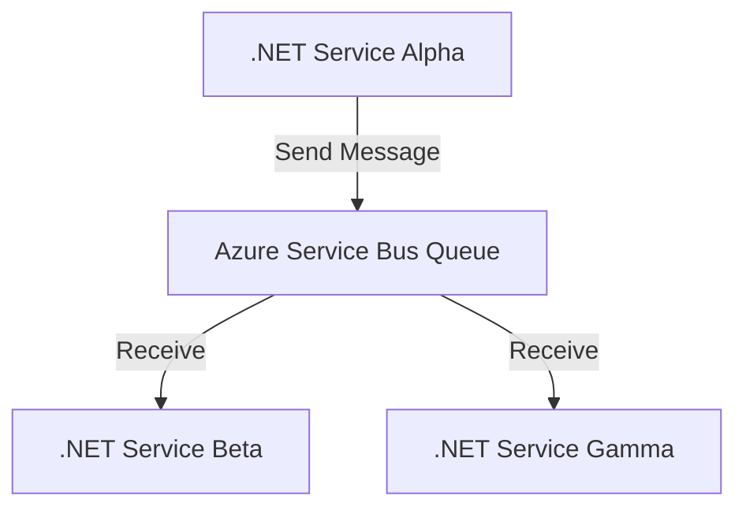

# .NET Azure Service Bus Example



## Overviews

This project demonstrates a minimal setup to use Azure Service Bus with .NET, showcasing an implementation of event-driven architecture. It includes examples for sending messages to a Service Bus topic, creating subscriptions to that topic, and receiving messages from the subscriptions.

Event-driven architecture is a software design pattern in which the flow of the program is determined by events such as user actions, sensor outputs, or messages from other programs or services. In this context, Azure Service Bus acts as both the event publisher and consumer.

Key aspects of event-driven architecture demonstrated in this project:

- Decoupling: Azure Service Bus allows for loose coupling between components, enabling greater flexibility and scalability.
- Asynchronous communication: Messages are sent and received asynchronously, improving system responsiveness.
- Event-driven flow: The system reacts to events (messages) as they occur, rather than following a predefined sequence of operations.
- Scalability: By using managed services like Azure Service Bus, the architecture can easily scale to handle varying loads.

This setup provides a foundation for building more complex event-driven systems, allowing developers to create responsive, scalable applications that can efficiently process and react to events in real time.

## Table of Contents

1. [Prerequisites](#prerequisites)
2. [Installation](#installation)
3. [Configuration](#configuration)
4. [Usage](#usage)
5. [Contributing](#contributing)
6. [License](#license)

## Prerequisites

- .NET Core 3.1 or higher
- Azure CLI configured with appropriate permissions
- Azure SDK for .NET (`Azure.Messaging.ServiceBus`)

## Installation

1. Clone the repository:

    ```bash
    git clone git@github.com:justjordant/dotnet-azure-service-bus.git
    ```

2. Navigate to the project directory:

    ```bash
    cd dotnet-azure-service-bus
    ```

3. Restore the project:

    ```bash
    dotnet restore
    ```

## Configuration

1. Rename the `appsettings.json.example` file to `appsettings.json` and fill in the required Azure Service Bus connection string and configurations.

    ```json
    {
      "Azure": {
        "ServiceBus": {
          "ConnectionString": "your-service-bus-connection-string"
        }
      }
    }
    ```

## Usage

### Send to Service Bus Topic

Run the following command to send a message to the Service Bus topic:

```bash
dotnet run --project ./service.alpha
```

### Receive from Service Bus Subscription

Run the following command to start receiving messages from a Service Bus subscription:

```bash
dotnet run --project ./service.beta
dotnet run --project ./service.gamma
```

## Contributing

1. Fork the repository.
2. Create a new feature branch.
3. Make your changes.
4. Submit a pull request.

For more details, see [CONTRIBUTING.md](CONTRIBUTING.md).

## License

This project is licensed under the MIT License. See [LICENSE.md](LICENSE.md) for details.

---

Feel free to adapt this README to better suit your project's specific needs.
