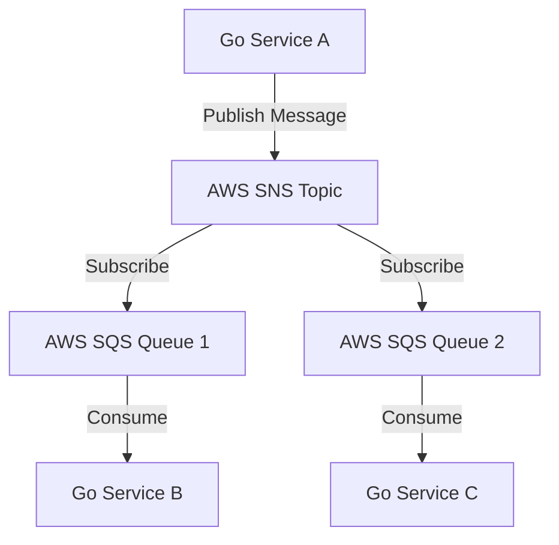

# Go AWS SNS/SQS Example



## Overview

This project demonstrates a minimal setup to use AWS SNS and SQS with Go. It includes examples for publishing messages to an SNS topic, subscribing an SQS queue to that topic, and consuming messages from the queue.

## Table of Contents

1. [Prerequisites](#prerequisites)
2. [Installation](#installation)
3. [Configuration](#configuration)
4. [Usage](#usage)
5. [Contributing](#contributing)
6. [License](#license)

## Prerequisites

- Go 1.16 or higher
- AWS CLI configured with appropriate permissions
- AWS SDK for Go (`github.com/aws/aws-sdk-go`)

## Installation

1. Clone the repository:

    ```bash
    git clone https://github.com/yourusername/go-aws-sns-sqs-example.git
    ```

2. Navigate to the project directory:

    ```bash
    cd go-aws-sns-sqs-example
    ```

3. Install dependencies:

    ```bash
    go mod download
    ```

## Configuration

1. Rename the `.env.example` file to `.env` and fill in the required AWS credentials and configurations.

    ```env
    AWS_REGION=your-aws-region
    AWS_ACCESS_KEY_ID=your-access-key-id
    AWS_SECRET_ACCESS_KEY=your-secret-access-key
    SNS_TOPIC_ARN=your-sns-topic-arn
    SQS_QUEUE_URL=your-sqs-queue-url
    ```

2. Load the environment variables:

    ```bash
    source .env
    ```

## Usage

### Publish to SNS Topic

Run the following command to publish a message to the SNS topic:

```bash
go run cmd/publish/main.go "Your message here"
```

### Consume from SQS Queue

Run the following command to start consuming messages from the SQS queue:

```bash
go run cmd/consume/main.go
```

## Contributing

1. Fork the repository.
2. Create a new feature branch.
3. Make your changes.
4. Submit a pull request.

For more details, see [CONTRIBUTING.md](CONTRIBUTING.md).

## License

This project is licensed under the MIT License. See [LICENSE.md](LICENSE.md) for details.

---

Feel free to adapt this README to better suit your project's specific needs.
