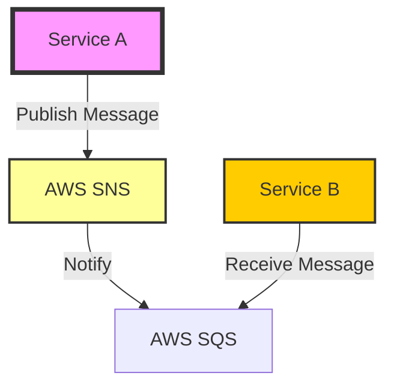

# communication-go-aws-sns-sqs
A minimal project showcasing using Go with AWS SNS,SQS

```mermaid
graph TD;
    A[Service A] -->|Publish Message| C[AWS SNS]
    B[Service B]
    C -->|Notify| D[AWS SQS]
    B -->|Receive Message| D
    style A fill:#f9f,stroke:#333,stroke-width:4px
    style B fill:#fc0,stroke:#333,stroke-width:2px
    style C fill:#ff9,stroke:#333,stroke-width:2px
```