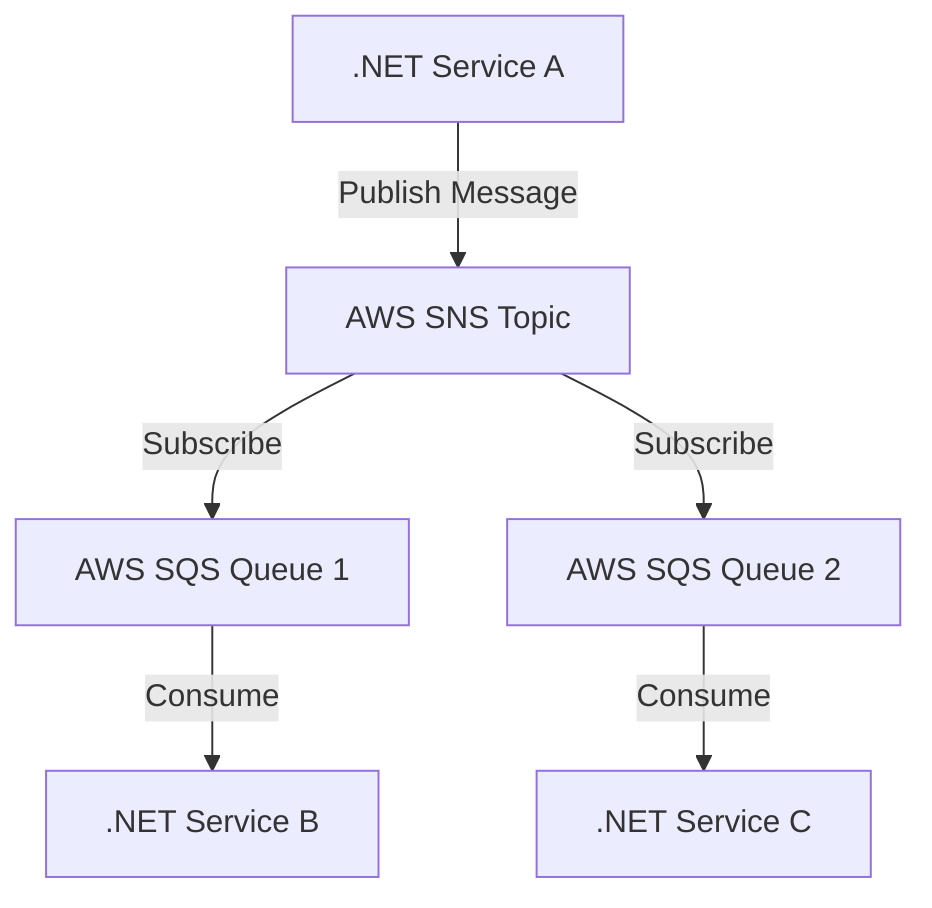

# .NET AWS SNS/SQS Example



## Overview

This project demonstrates a minimal setup to use AWS SNS (Simple Notification Service) and SQS (Simple Queue Service) with .NET, showcasing an implementation of event-driven architecture. It includes examples for publishing messages to an SNS topic, subscribing an SQS queue to that topic, and consuming messages from the queue.

Event-driven architecture is a software design pattern in which the flow of the program is determined by events such as user actions, sensor outputs, or messages from other programs or services. In this context, AWS SNS acts as the event publisher, while SQS serves as the event consumer.
Key aspects of event-driven architecture demonstrated in this project:

- Decoupling: SNS and SQS allow for loose coupling between components, enabling greater flexibility and scalability.
- Asynchronous communication: Messages are sent and received asynchronously, improving system responsiveness.
- Event-driven flow: The system reacts to events (messages) as they occur, rather than following a predefined sequence of operations.
- Scalability: By using managed services like SNS and SQS, the architecture can easily scale to handle varying loads.

This setup provides a foundation for building more complex event-driven systems, allowing developers to create responsive, scalable applications that can efficiently process and react to events in real time.

## Table of Contents

1. [Prerequisites](#prerequisites)
2. [Installation](#installation)
3. [Configuration](#configuration)
4. [Usage](#usage)
5. [Contributing](#contributing)
6. [License](#license)

## Prerequisites

- .NET Core 3.1 or higher
- AWS CLI configured with appropriate permissions
- AWS SDK for .NET (`AWSSDK.Core`, `AWSSDK.SNS`, `AWSSDK.SQS`)

## Installation

1. Clone the repository:

    ```bash
    git clone git@github.com:JustJordanT/communication-dotnet-aws-sns-sqs.git
    ```

2. Navigate to the project directory:

    ```bash
    cd dotnet-aws-sns-sqs-example
    ```

3. Restore the project:

    ```bash
    dotnet restore
    ```

## Configuration

1. Rename the `appsettings.json.example` file to `appsettings.json` and fill in the required AWS credentials and configurations.

    ```json
    {
      "AWS": {
        "Region": "your-aws-region",
        "AccessKeyId": "your-access-key-id",
        "SecretAccessKey": "your-secret-access-key"
      },
      "SNS": {
        "TopicARN": "your-sns-topic-arn"
      },
      "SQS": {
        "QueueURL": "your-sqs-queue-url"
      }
    }
    ```

## Usage

### Publish to SNS Topic

Run the following command to publish a message to the SNS topic:

```bash
dotnet run --project ./src/Publish
```

### Consume from SQS Queue

Run the following command to start consuming messages from the SQS queue:

```bash
dotnet run --project ./src/Consume
```

## Contributing

1. Fork the repository.
2. Create a new feature branch.
3. Make your changes.
4. Submit a pull request.

For more details, see [CONTRIBUTING.md](CONTRIBUTING.md).

## License

This project is licensed under the MIT License. See [LICENSE.md](LICENSE.md) for details.

---

Feel free to adapt this README to better suit your project's specific needs.
