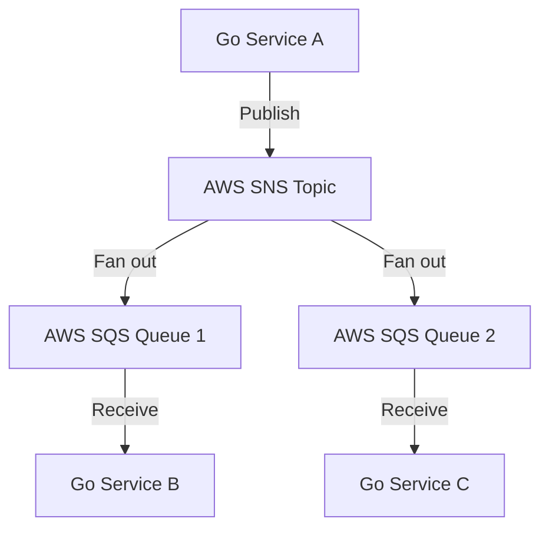

# Go AWS Event-Driven Architecture

## Architecture Overview
This project implements a serverless event-driven architecture using AWS SNS (Simple Notification Service) and SQS (Simple Queue Service). The pattern combines the immediate fan-out capabilities of SNS with the reliable message processing of SQS to create a robust, scalable messaging system.

### Why SNS + SQS?
- **Reliability**: Guaranteed message delivery with built-in retry logic and dead-letter queues
- **Scalability**: Handles millions of messages with automatic scaling
- **Decoupling**: Services can evolve independently without affecting each other
- **Flexibility**: Easy to add new consumers without modifying existing code
- **Cost-Effective**: Pay only for what you use with serverless infrastructure

### System Flow
1. Publisher sends a single message to SNS Topic
2. SNS automatically fans out to multiple SQS queues
3. Consumer services process messages at their own pace
4. Built-in error handling with dead-letter queues
5. Automatic message tracking and monitoring

This architecture is ideal for systems requiring reliable message delivery, service decoupling, and independent scaling of components.

Key features:
- Message publishing via SNS
- Message consumption via SQS
- Decoupled service architecture
- Scalable message processing

## Prerequisites
- Go 1.21+
- AWS Account
- AWS CLI configured
- AWS SDK for Go v2

## Configuration
Required AWS resources:
- SNS Topic
- SQS Queues (one per consumer)
- IAM roles with appropriate permissions

## Infrastructure Setup
1. Create SNS Topic
2. Create SQS Queues
3. Subscribe SQS queues to SNS Topic
4. Configure Dead Letter Queues (recommended)

